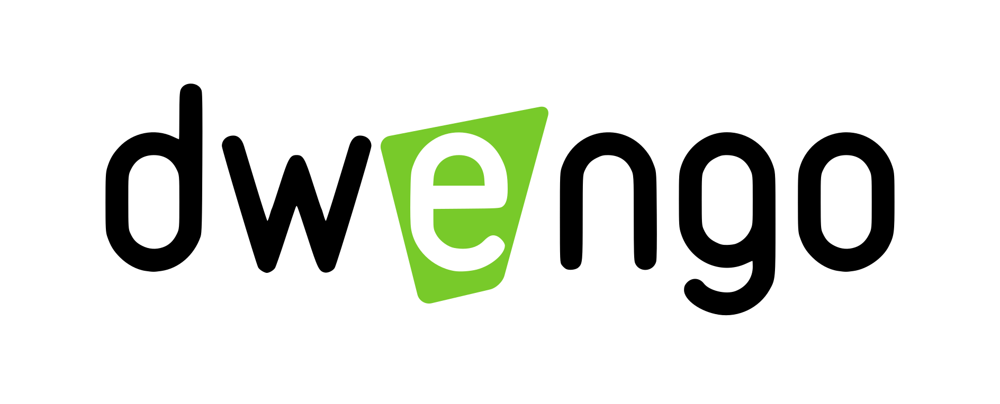
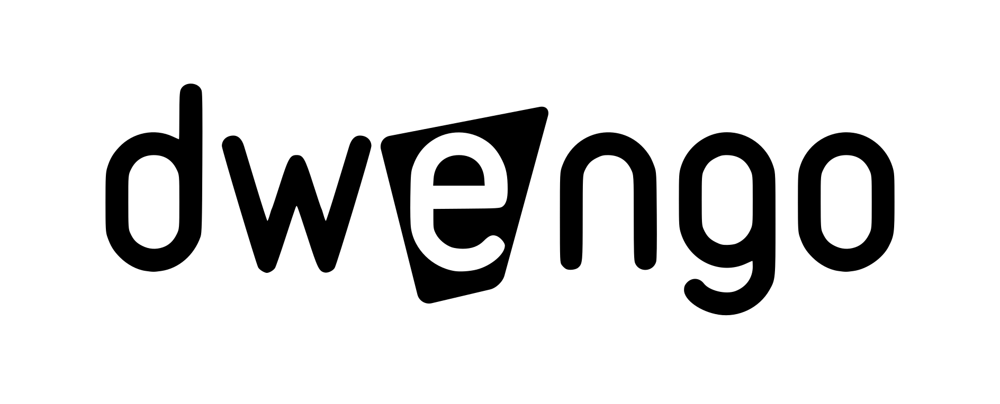
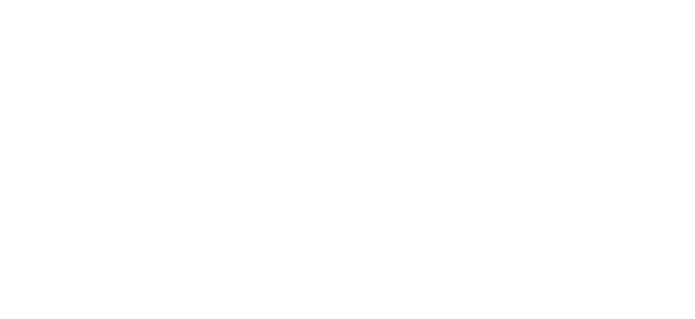

Dwengo Style-Guide
=============

Fonts
------

Dwengo uses [Roboto by Christian Robertson](https://fonts.google.com/specimen/Roboto)

Logo
----

The Dwengo logo consists of the lowercase word 'dwengo' with a green inverted 'e'. There's different versions for use on a dark (black) or light (white) background and there's a white and black only version.

* White version for use on a dark/black background: 

* White version for use on a light/white background: 

* Completely black version for use in other contexts where colour is not available or not approriate: 

* Completely white version for use in other contexts where colour is not available or not approriate:

Project logos
--------------

Some of our projects, e.g. WeGoSTEM, have their own logo. These logos are used in combination with the Dwengo logo. After approval, the Dwengo logo can be re-coulered to match the colour of the project logo...

Examples to be added...
