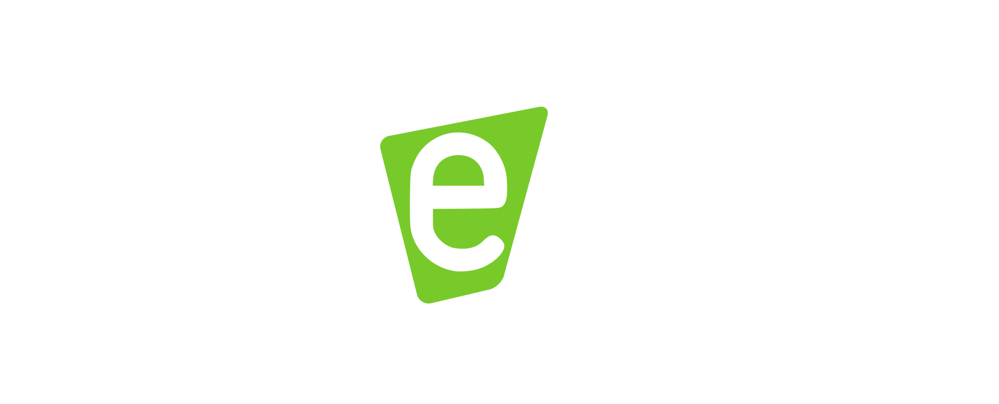

Dwengo Style-Guide
=============

Fonts
------

Dwengo uses [Roboto by Christian Robertson](https://fonts.google.com/specimen/Roboto)

Logo
----

The Dwengo logo consists of the lowercase word 'dwengo' with a green inverted 'e'. There's different versions for use on a dark (black) or light (white) background and there's a white and black only version.

* White version for use on a dark/black background: 

* White version for use on a light/white background: 

* Completely black version for use in other contexts where colour is not available or not approriate: 

* Completely white version for use in other contexts where colour is not available or not approriate:

Dwengo colors
--------------

Below you can find the official dwengo colors. Specific projects may have their own color scheme.

### Official dwengo color

Main color (R = 133, G = 196, B = 65) or (C = 53, M = 0, Y = 100, k = 0)

Support color (R = 109, G = 164, B = 53) or (C = 53, M = 0, Y = 100, k = 20)

(Optional) sub color (R = 90, G = 140, B = 44) or (C = 53, M = 0, Y = 100, k = 35)

### dwengo color for primary school

Main color (R = 247, G = 148, B = 30) or (C = 0, M = 50, Y = 100, k = 0)

Support color (R = 224, G = 134, B = 26) or (C = 0, M = 50, Y = 100, k = 10)

(Optional) sub color (R = 204, G = 123, B = 22) or (C = 0, M = 50, Y = 100, k = 20)

### dwengo color for secondary school

Main color (R = 239, G = 65, B = 35) or (C = 0, M = 90, Y = 100, k = 0)

Support color (R = 217, G = 59, B = 32) or (C = 0, M = 90, Y = 100, k = 10)

(Optional) sub color (R = 197, G = 53, B = 28) or (C = 0, M = 90, Y = 100, k = 20)

### dwengo color for other projects

Main color (R = 202, G = 55, B = 64) or (C = 20, M = 94, Y = 81, k = 0)

Support color (R = 185, G = 40, B = 59) or (C = 29, M = 100, Y = 86, k = 0)

(Optional) sub color (R = 161, G = 44, B = 62) or (C = 43, M = 100, Y = 86, k = 0)

### dwengo color for international projects

Main color (R = 65, G = 181, B = 231) or (C = 64, M = 10, Y = 0, k = 0)

Support color (R = 53, G = 144, B = 185) or (C = 64, M = 10, Y = 0, k = 25)

(Optional) sub color (R = 46, G = 130, B = 167) or (C = 64, M = 10, Y = 0, k = 35)

Project logos
--------------

Some of our projects, e.g. WeGoSTEM, have their own logo. These logos are used in combination with the Dwengo logo. After approval, the Dwengo logo can be re-coulered to match the colour of the project logo...

Examples to be added...
